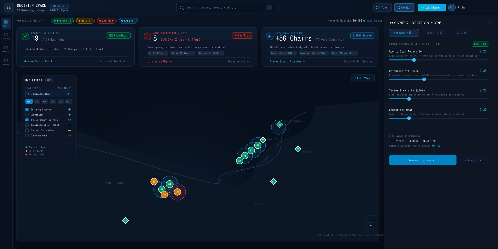

# Decision Space | Retail Geospatial Intelligence Platform

**Current Release: V.01 (Baseline Snapshot)** | [Version Changelog](./VERSIONS.md)

> **Geospatial decision-support system and portfolio optimization engine for Bedashing Beauty Lounge's 23-store network across the United Arab Emirates.**

<div align="center">
  
  <p><em>Decision Space Executive Geospatial Interface: UAE network health, cannibalization overlap monitoring, thermal competitor saturation, and sensitivity decision drawer.</em></p>
</div>

---

## 1. Business Context & Strategic Purpose

**Bedashing Beauty Lounge** operates 23 premier beauty locations across the UAE. As the brand expands, leadership faces key capital allocation dilemmas:

1. **Portfolio Defense vs. Rightsizing**: Identifying high-margin stores to protect versus underperforming locations facing saturation.
2. **Sister-Branch Cannibalization**: Managing urban expansion where stores fall within competing trade areas (< 4.0 km separation), diluting revenue.
3. **White-Space Expansion**: Targeting new capital deployment in high-growth corridors without cannibalizing existing stores.

**Decision Space** delivers a unified, deterministic, and AI-grounded intelligence platform to answer these questions for executive leadership.

---

## 2. Core Capabilities

*   **Interactive Geospatial Map**: Leaflet-powered maps featuring 3km catchments, competition saturation heatmaps, white-space gap analysis, and automated camera navigation.
*   **Market Saturation Metrics**: 4-tier classification (Moat to Hyper-Saturated) integrated into badges, filters, and sortable tables.
*   **Deterministic Scoring Engine**: Auditable multi-factor evaluation scoring existing branches (PROTECT, HOLD, SHRINK) and candidate zones (GROW, WATCH, SKIP), featuring 4 interactive simulation presets.
*   **Cannibalization Detection**: Continuous Haversine-based proximity monitoring flagging lounges with < 4.0 km separation.
*   **Dynamic Sensitivity Modeling**: Real-time slider controls for executives to adjust weighting matrices instantly.
*   **Grounded AI Board Advisor**: Dual-path executive briefing engine (Gemini 3.8 Flash + deterministic fallback) generating formal Memos and interactive slide carousels, with decision pinning protocols.
*   **Guided Executive Tour**: Interactive 6-step onboarding workflow covering core platform capabilities.

---

## 3. Quick Start: Local Installation

Follow these steps to run Decision Space locally.

### Prerequisites
*   **Node.js**: `20.x` or higher (`18.x` LTS supported)
*   **npm**: `9.x` or higher (or `pnpm` / `bun`)
*   **Git**

### Installation

```bash
# 1. Clone the Repository
git clone https://github.com/your-org/decision-space.git
cd decision-space

# 2. Install Dependencies
npm install

# 3. Configure Environment (Optional)
cp .env.example .env
```

**`.env` Reference:**
*   `GEMINI_API_KEY`: For AI Advisor (optional, falls back to deterministic generator).
*   `CARTO_API_KEY`: Removes map watermark (optional, default provided).

### Execution

```bash
# Run Development Server
npm run dev
# Go to http://localhost:3000

# Build & Run Production
npm run build
npm start
```

---

## 4. Architecture Structure

```text
decision-space/
├── AGENTS.md               # AI Agent instructions & sync rules
├── README.md               # Project overview
├── package.json            # Node manifest & scripts
├── server.ts               # Express backend (Gemini API proxy, static docs)
├── docs/                   # Technical & strategic documentation
│   ├── index.html          # Standalone docs web page
│   └── video_transcript... # Demo video transcript
├── public/                 # Static assets
└── src/                    # React 19 Client
    ├── data/               # Branch & Candidate datasets
    ├── services/           # Scoring engine & Auth
    └── components/         # UI Components (Nav, Maps, Modals, Views)
```

---

## 5. Data Provenance & Grounding

Data is strictly audited across three tiers:
1.  **Verified Public Data**: Names, addresses, geocodes, and Google ratings extracted from public directories.
2.  **Deterministic In-Code Math**: Distance matrices and scoring calculated entirely in-memory using Haversine formulas.
3.  **AI-Curated Proxies**: Attributes like Catchment Affluence Index, chair counts, and monthly visitors are modeled heuristics based on public brackets and commercial beauty space-planning standards, not confidential live POS or architectural data.

Full details are available in the interactive **Provenance Matrix** at `/docs`.

---

## 6. Documentation Maintenance Protocol

As detailed in `AGENTS.md`, any AI agent modifying this codebase MUST:
1.  Update both `docs/index.html` and `README.md` concurrently for any data or formula changes.
2.  Maintain 100% lockstep for all formulas, cutoffs (e.g., `PROTECT` ≥ 85), and distances (e.g., 4.0km sister buffer) across code and documentation.
